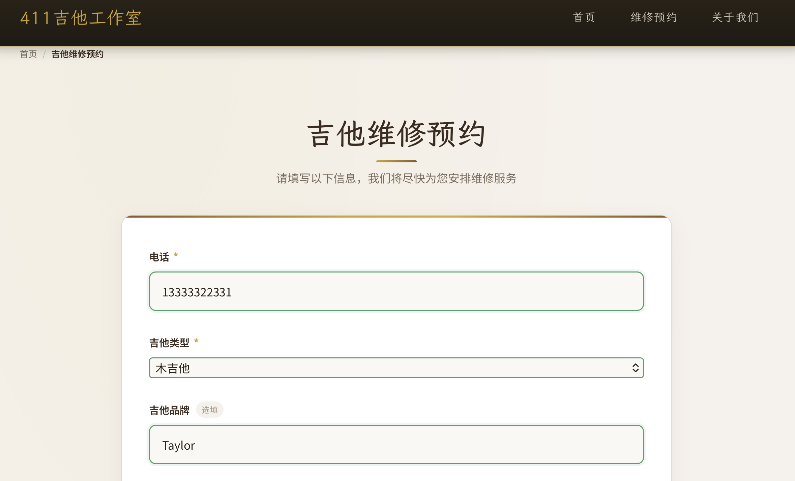
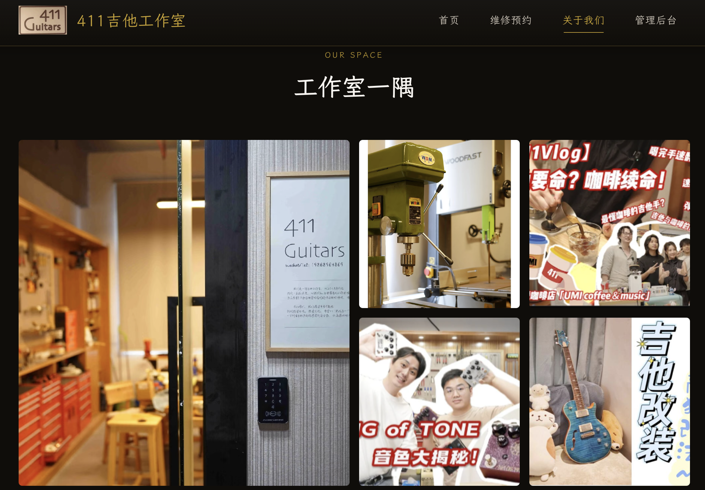

# 411吉他工作室

> 深圳 · 专业吉他维修保养 · Since 2018

基于 HTML/CSS/JavaScript + Supabase 构建的吉他维修预约管理系统。

## 页面预览

### 首页


### 维修预约


### 关于我们


## 功能概览

### 客户端
- **在线预约** — 选择吉他类型、描述问题、上传图片/视频、选择日期时间段
- **订单查询** — 通过手机号查询订单状态、排班人员、管理员备注
- **闲忙日历** — 实时查看每日预约密度（空闲/一般/繁忙）

### 管理后台
- **订单管理** — 卡片视图 + 表格视图，支持多维度筛选、快速状态修改
- **日历视图** — 月度预约分布，点击日期查看时间段详情
- **数据可视化** — 状态分布饼图、近7天趋势折线图
- **快捷操作** — 批量更改状态、按条件导出 CSV

### 品牌展示
- 首页服务介绍、小红书内容卡片、路线指引、社交媒体入口
- 关于我们：品牌故事、双主理人（达三 & 木木）、六大服务、工作室图集

## 技术栈

| 层级 | 技术 |
|------|------|
| 前端 | HTML5 + CSS3 (BEM) + JavaScript ES6+ Modules |
| 字体 | LXGW WenKai TC · Caveat · Noto Sans SC（Google Fonts） |
| 图表 | Chart.js 4.4.1 |
| 后端 | Supabase（PostgreSQL + Auth + Storage + RLS） |
| 部署 | GitHub Pages |

## 快速开始

```bash
# 1. 克隆项目
git clone https://github.com/xie96808/activity.git
cd activity

# 2. 配置 Supabase（参考 docs/supabase-setup-guide.md）
#    - 创建 guitar_repairs 表
#    - 配置 RLS 策略
#    - 创建 guitar-images Storage Bucket

# 3. 修改 js/supabase-client.js 中的凭证
#    SUPABASE_URL = 'your_url'
#    SUPABASE_ANON_KEY = 'your_key'

# 4. 启动
npm install && npm run dev
# 或 python -m http.server 8000
```

## 项目结构

```
activity/
├── index.html              # 首页
├── booking.html            # 维修预约
├── about.html              # 关于我们
├── order-query.html        # 订单查询
├── admin.html              # 管理员登录
├── admin-dashboard.html    # 管理后台
├── css/
│   ├── layout-new.css      # 主样式（暖色木纹主题）
│   ├── responsive-new.css  # 响应式
│   ├── animations-new.css  # 动画
│   ├── booking.css         # 预约页面
│   └── about.css           # 关于页面
├── js/
│   ├── supabase-client.js  # Supabase API
│   ├── main.js             # 核心逻辑
│   ├── form-handler.js     # 表单处理
│   ├── admin-dashboard.js  # 管理后台
│   ├── calendar.js         # 日历组件
│   └── image-upload.js     # 文件上传
├── images/
│   ├── background/         # 页面素材
│   └── readme/             # README 截图
└── docs/                   # 配置文档
```

## 数据库设计

`guitar_repairs` 表核心字段：

| 字段 | 类型 | 说明 |
|------|------|------|
| id | uuid | 主键 |
| customer_phone | varchar(20) | 客户电话 |
| guitar_type / brand / model | varchar | 吉他信息 |
| problem_description | text | 问题描述 |
| image_urls | varchar[] | 图片/视频 URL |
| appointment_date / time | date / varchar | 预约日期时间 |
| expected_completion_date | date | 期望完成日期 |
| status | varchar(20) | 订单状态 |
| assigned_to | varchar(50) | 排班人员 |
| admin_notes | text | 管理员备注 |

订单状态：`pending`(待排期) → `confirmed`(已确认) → `in_progress`(进行中) → `completed`(已完成)，另有 `delayed`(延期) 和 `cancelled`(已取消)。

## 联系方式

- **双主理人**: 达三 & 木木
- **电话**: 13355788990
- **地址**: 深圳市福田区八卦岭工业区618栋3楼320
- **小红书**: [411吉他工作室](https://xhslink.com/m/4SM0Fk9mh2I)
- **哔哩哔哩**: [411吉他工作室](https://b23.tv/yA896Lk)

## License

MIT
